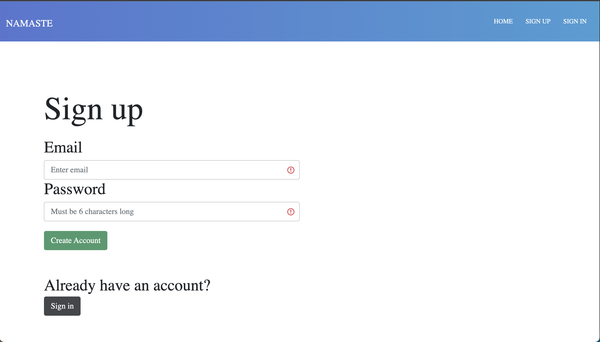
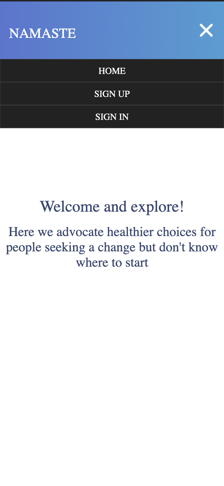
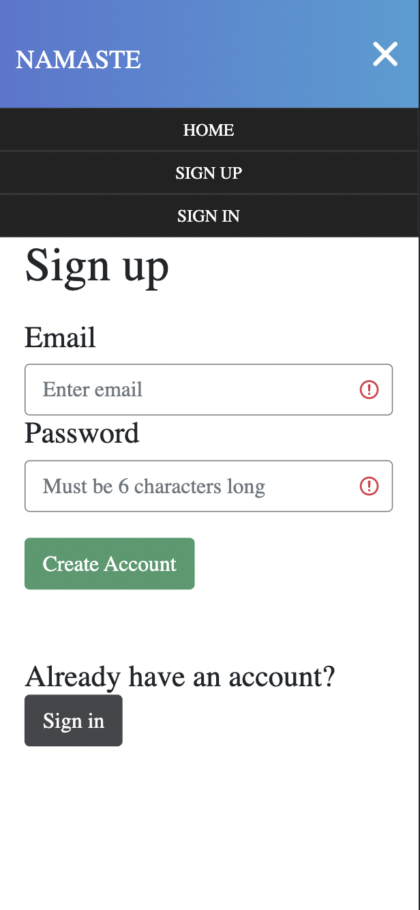

# Getting Started

First, install dependencies then run the development server:

```bash
# first run in terminal to install dependencies
npm install
# second start server
npm run dev
```

Open [http://localhost:3000](http://localhost:3000) with your browser to see the result.

## Motivation

The motivation behind this website it spread positivity and promote well being.

## Desktop Signup Page



## Mobile Screenshots

### Home



### Signup



## Tech Stack

React, JavaScript, Next.js, Cloud Firestore, Google Auth, BootStrap, Figma

## Future Development

This will be an ongoing project to promote well-ness.
