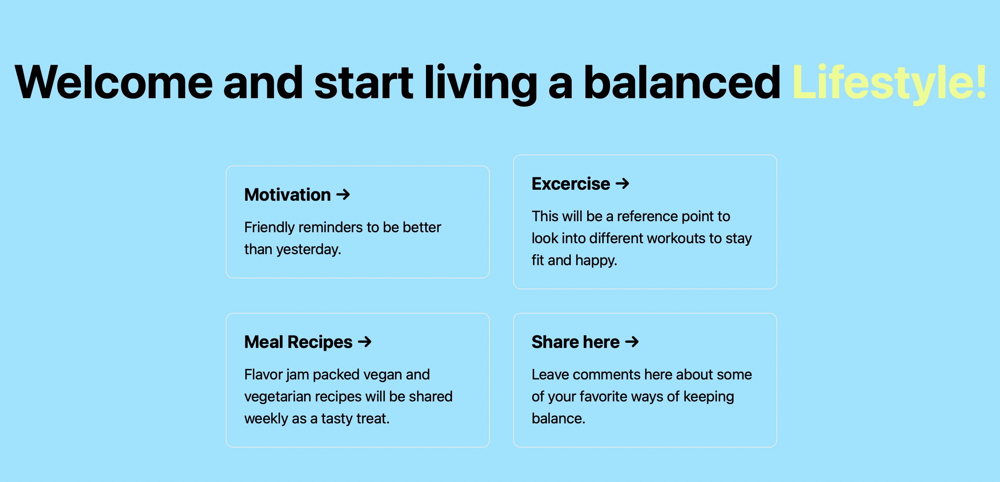
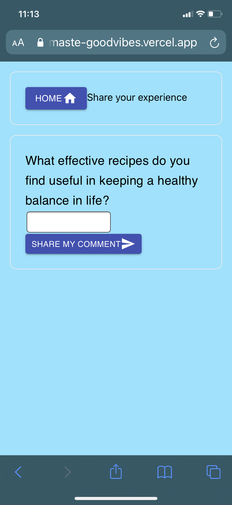

# Getting Started

First, install dependencies then run the development server:

```bash
npm install
# and
npm run dev
```

Open [http://localhost:3000](http://localhost:3000) with your browser to see the result.

## Motivation

The motivation behind this website it spread positivity and promote well being.

## Home Page



## Mobile Screenshots

### Leave a comment section



### Meal section


## Tech Stack

React, JavaScript, Next.js, Firebase, MaterialUI, Figma

## Future Development

Compliments to unsplash for the photo of the smoothie.
This will be an ongoing project to promote well-ness.
